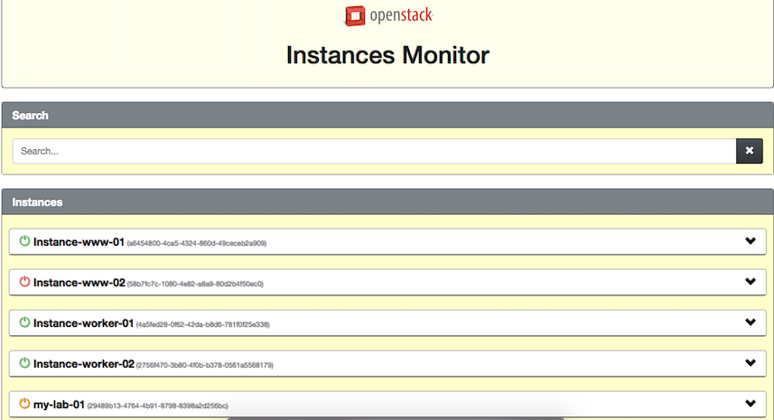
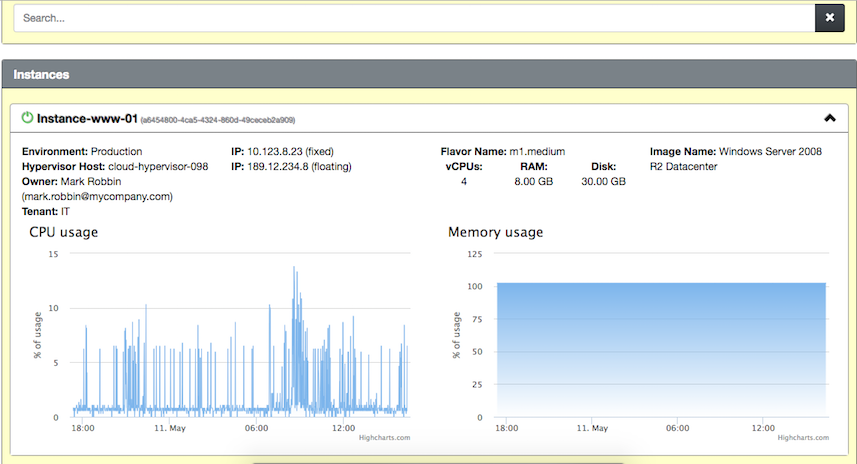

# openstack-instances-monitoring

OpenStack Instances Monitor is a simple project to show how much each instance in your project is consuming on your hypervisors.


### Installing the tool

* clone this repository
```sh
$ git clone git@github.com:renato-farias/openstack-instances-monitoring.git
```
* installing all dependecies (OS)
```sh
$ cd openstack-instances-monitoring
$ setup/setup.sh
```
* installing all dependecies (Python Application)
```sh
$ cd openstack-instances-monitoring
$ mkvirtualenv monitoring
$ workon monitoring
$ pip install -r setup/requirements.txt
```
* change the setting and run the app
```sh
$ cd openstack-instances-monitoring/app
$ mv application_sample.yaml application.yaml
$ gunicorn -b 0.0.0.0:8000 app:app --log-level info --env APP_ENV='production' --reload -w 4 --timeout 60
```
* point your browser to http://SERVER:8000/
* In your first access access: http://SERVER:8000/renew - To make the initial cache.
* insert in the root's cron the following entry (It's responsible to collect data from openstack API avoiding to take too time to get some informations about all instances):
```sh
1 * * * * curl http://localhost:8000/renew
```

### Installing the collector on the Hypervisors
* Get the script
```sh
# wget -c http://SERVER:8000/scripts/monit_instances.sh
```
* Edit the script pointing the server IP or Name to send data.
* insert in the root's cron the following entry:
```sh
* * * * * /root/monit_instances.sh
```


### Customization
It's a tool with a simple endpoit API to collect data. Feel free using your imagination to customize this.


### How it looks



I'd like to say thank you to Crapworks. I used his template from [Ceph-Dash](https://github.com/Crapworks/ceph-dash) to turn easy my job =]
